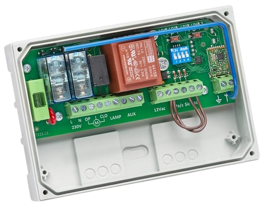

# Introduzione

Le centraline DRSCB433 e DCRSCBMF fanno della semplicità e della sicurezza i loro punti di forza\.

Caratterizzate per il loro design semplice, le loro funzioni essenziali e la struttura del box in ABS, le centraline sono progettate per comandare serrande, tende, tapparelle e vasistas\.

La ricevente che montano a bordo è di altissima qualità: 

\-	DRSCB433: monta una ricevente in grado di apprendere codici fissi e rolling code a 433 MHz

\-	DRSCBMF: monta una ricevente in grado di apprendere codici fissi e rolling code da 433 MHz a 868 MHz

La centralina DRSCBMF ha inoltre un’uscita ausiliaria in grado di comandare una luce di cortesia, un lampeggiante aggiuntivo o qualsiasi altro dispositivo che ha la necessità di essere attivato\.

 

## Avvertenze importanti

Domotime Srl si riserva il diritto di apportare modifiche tecniche al prodotto senza preavviso; declina inoltre ogni responsabilità per danni a persone o cose dovuti a uso improprio o installazione errata della centralina DRSCBMF o della centralina DRSCB433\.

Questo manuale di istruzioni è destinato esclusivamente a personale tecnico qualificato nel campo delle installazioni di automazione\.

Nessuna delle informazioni contenute in questo manuale è destinata all'utente finale\.

Per chiarimenti tecnici o problemi di installazione, Domotime Srl dispone di un servizio di assistenza clienti, che risponde al numero di telefono 030 9913901\.