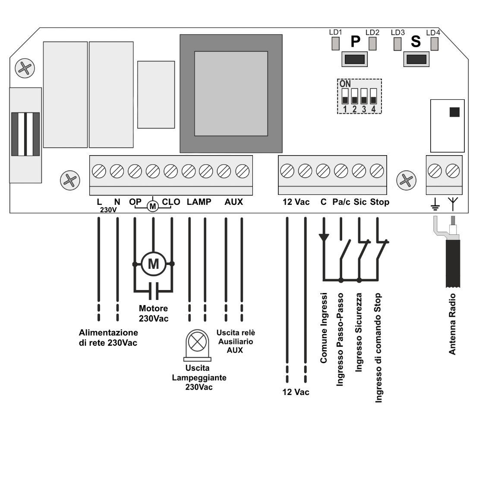

| Sigla | Funzione |
| - | - |
| **L** | Ingresso fase di rete 230 Vac |
| **N** | Ingresso neutro di rete 230 Vac |
| **OP** | Motore, avvolgimento apertura |
| **CLO** | Motore, avvolgimento chisura |
| **LAMP** | Lampeggiante 230 Vac |
| **AUX** | Relè ausiliario con contatto pulito |
| **12 Vac** | Uscita tensione di servizio 12 Vac |
| **C** | Comune ingressi |
| **Pa/c** | Ingresso Passo-Passo (NO) |
| **Sic** | Ingresso sicurezza (NC) |
| **Stop** | Ingresso comando di stop (NC) |
| | Calza interna |
| | Polo caldo antenna |